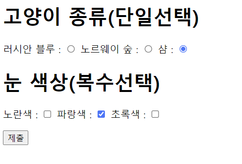

**type속성**과 함께 사용하는 용어이다.

### radio: 체크를 할 수 있는 동그란 원이 생긴다.(복수체크 가능)

선택을 한 개만 하게 할려면, name속성을 사용해 이름을 똑같이 붙여주면 된다.

### Check box: 복수 체크 할 수 있는 상자가 생긴다.

name이 같아도 복수 체크가 된다.

- checked: 선택되었으면 하는 항목에 붙이는 속성이다.

***배운걸로 웹페이지를 만들어보자***

-----------------------------------------------------------------------------------

```html
<html>
    <head>
        <meta charset="utf-8">
    </head>
    <body>
        <form action="http://niceday/type.php">
            <p>
                <h1>고양이 종류(단일선택)</h1>
            러시안 블루 : <input type="radio" name="cat" value="russian">
            노르웨이 숲 : <input type="radio" name="cat" value="norway">
            샴 : <input type="radio" name="cat" value="siamese" checked>
            </p>
            <p>
                <h1>눈 색상(복수선택)</h1>
            노란색 : <input type="checkbox" name="eye" value="yellow">
            파랑색 : <input type="checkbox" name="eye" value="blue" checked>
            초록색 : <input type="checkbox" name="eye" value="green">
            </p>
            <input type="submit">
        </form>
    </body>
</html>
```


**결과**

-------------------------------------------------------------------------------------------------
<html>
    <body>
         
    </body>
</html>
